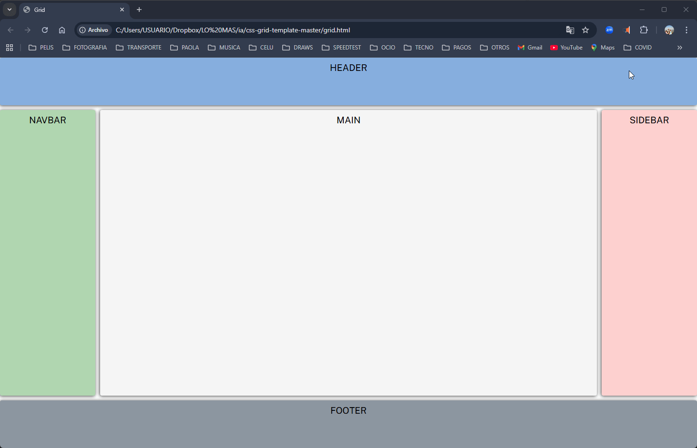

🧩 Maquetación con CSS Grid
Este repositorio contiene una maquetación básica realizada con CSS Grid, pensada como ejercicio práctico para dominar la creación de layouts modernos y responsivos en la web.
​
---

##✨ Vista previa

--- 

## ✨ Pruevalo Online

[Maquetacion](https://jcduro.bexartideas.com/proyectos/efecto_card_anime/index.html)

--- 

🚀 Características
Estructura clásica de página: header, navbar, sidebar, contenido principal y footer.
Uso de CSS Grid para definir áreas y distribuir el layout.
Código simple y legible, ideal como base para proyectos más grandes o para practicar maquetación.

--- ​

## 🌟 Programas

HTML5 – Estructura principal del sitio
CSS3 – Animaciones, efectos visuales y estilo responsive
Grid – Distribución de elementos adaptable
Hover Flip Effect – Efecto de giro para mostrar descripciones al pasar el cursor

--- 

📁 Estructura del proyecto
grid.html: Archivo principal con la estructura HTML de la maqueta.

css/ (opcional si lo tienes): Hojas de estilo con la configuración de CSS Grid y estilos visuales.
img/ (opcional): Carpeta para recursos gráficos si decides agregar logos o imágenes.
(Ajusta o agrega archivos según tu estructura real.)

🛠️ Tecnologías usadas
HTML5 para la estructura del documento.

CSS3 (CSS Grid) para el sistema de maquetación y el layout general de la página.

--- ​

▶️ Cómo ver el proyecto
Clonar o descargar este repositorio.
Abrir el archivo grid.html en tu navegador favorito.
​

Opcional: Servirlo con un servidor local (por ejemplo con VS Code Live Server) para un flujo de desarrollo más cómodo.

--- 

## 📊 Lenguajes y Herramientas

---

##🚀 Características principales

✅ Diseño responsive adaptable a distintos dispositivos

---

✨ Próximas mejoras (ideas)
Adaptar el layout a diseño responsive para móviles y tablets.
Añadir estilos avanzados (colores, tipografías, hover, etc.).
Integrar componentes dinámicos usando JavaScript.
